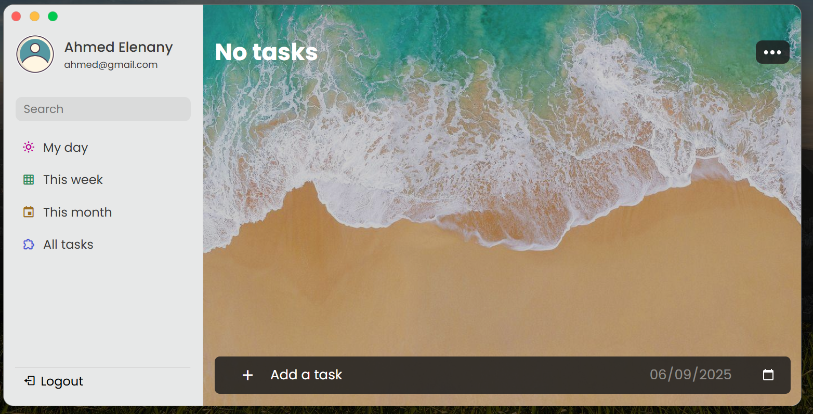
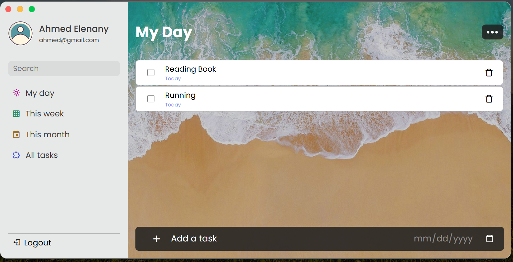
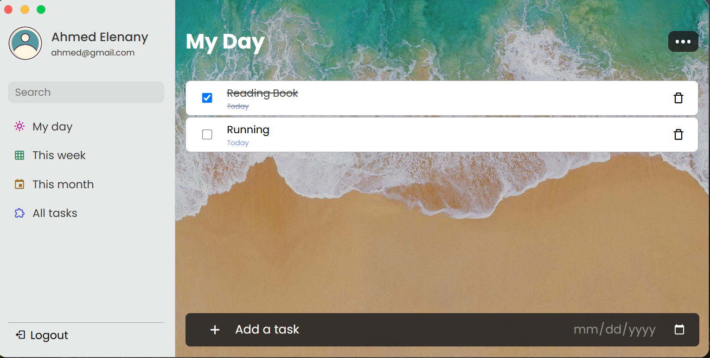

# todo-aws-project
Deploy todo app in AWS with using terraform to provision infrastructure.

## Screenshots for the app

- **Home page**


- **Tasks**


- **Finish first task**


## Docker

- Build the image using: 
```bash
  docker build -t app:v1 .
```
- Run the container and access the the app from browser on `localhost:8080`.
```bash
  docker run -d -p 8080:8080 --name todo-app app:v1
```
